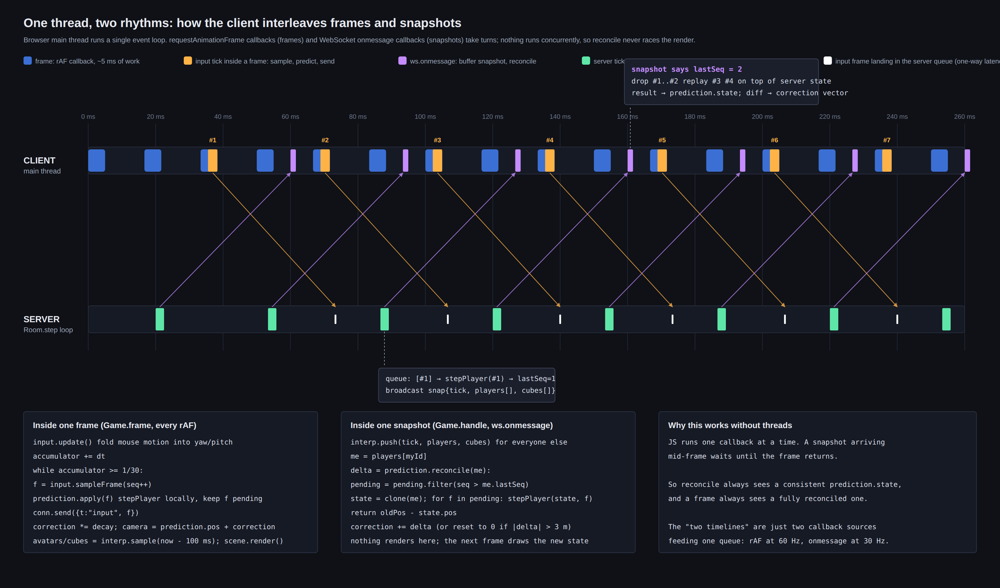
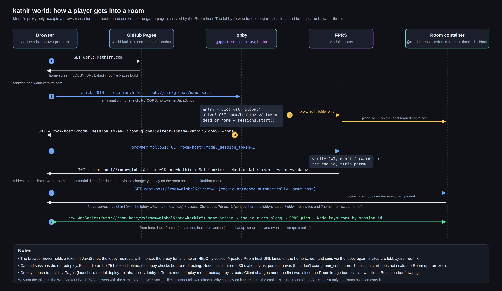
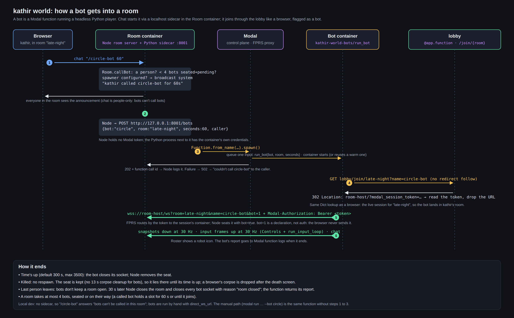

# Development

## Run it locally

```bash
npm install
npm run dev        # room server on :8787 + Vite client on :5173
```

Open http://localhost:5173 in two tabs, join the same room code, and you're in multiplayer.
Invite links look like `http://localhost:5173/?room=<code>`; add `&name=<name>` to skip the form.

Useful while iterating:

```bash
npm run typecheck                  # all packages
npm test                           # sim + room unit tests, and a real-server integration test
npm run e2e                        # two headless browsers in one room (needs Chromium; set CHROMIUM_PATH if not default)
python -m pytest modal-bots/tests  # headless Python protocol + real-server contract tests
SIM_LATENCY_MS=120 SIM_JITTER_MS=40 npm run dev:server   # watch prediction/reconciliation under lag
```

## Layout

```
packages/shared    @world/shared   pure TS: sim (movement, cubes, combat, items, avatars), protocol, Room host, content
packages/client    @world/client   Vite + Babylon: home screen, rendering, input, prediction, interpolation, HUD
packages/server    @world/server   Node: WebSocket room server, one process hosts many rooms, serves the client on Modal
infra/                             Modal: lobby web function + sessioned Room server (Python package)
modal-bots/                        Separate Modal app: headless Python clients and shared connection framework
modal-bots/                        headless Python players run as a Modal app (see Bots below)
docs/                              this file and the diagrams (sources in docs/src, rendered with headless Chromium)
```

`packages/shared` has no DOM or Node dependencies on purpose: the same `stepPlayer` runs on the
server (authoritative) and in the browser (prediction), which is what lets reconciliation be exact.
Anything about a player (position, item, avatar, hearts, boost) lives in `PlayerState` and is
carried in every snapshot; the wire format is `packages/shared/src/protocol.ts`.

## How multiplayer works

- The client samples input at 30 Hz into numbered `InputFrame`s, applies each one locally right
  away (prediction), and sends it to the room.
- The room ticks at 30 Hz, applies each player's queued frames with the shared sim, steps the cubes,
  and broadcasts a snapshot of everyone.
- On each snapshot the client rewinds its own player to the server's state and replays the frames
  the server hasn't acknowledged yet. Any residual difference is smoothed out over ~60 ms.
- Remote players and cubes are rendered 3 ticks behind the newest snapshot, interpolating between
  the two snapshots that bracket that time.
- Look direction is client-authoritative; movement, jumping, shooting and damage are
  server-authoritative. Chat commands (`/gun`, `/speedy`, `/elizabeth`, ...) are parsed and run in
  the Room.

Rooms are keyed by the `x-modal-server-session-id` header the Modal proxy stamps on the WebSocket
upgrade, or by `?room=` when the server runs bare.



## Hosting

The backend is a Modal App in `infra/`: a `lobby` web function and a sessioned `Room` server that
runs the Node room server and also serves the built client.

```bash
pip install -r infra/requirements.txt   # needs a client with @modal.sessioned(), see the file
modal serve -m infra.app                # or modal deploy -m infra.app
```

Joining goes through a redirect: `GET <lobby>/join/<room>?name=<name>` starts a session (or reuses
the live one cached in a Dict) and sends the browser to the Room host with the session token in the
URL. Modal's proxy swaps that for a host-bound cookie, the Room's Node process serves the page, and
the game's WebSocket is then same-origin so the cookie covers it. The page therefore runs on the
Room host while playing. The served page carries the lobby's URL in a meta tag, so a pasted Room
host URL still joins through the lobby.

GitHub Pages (`.github/workflows/deploy.yml`) keeps serving a copy of the client at
world.kathirm.com as a launcher: set the `LOBBY_URL` repository variable to the lobby's URL and
its join buttons navigate to the lobby. Without it, that copy offers offline mode only. Pushing to
main deploys Pages; the Modal side is a separate `modal deploy`, and client changes need both since
the Room image bundles its own copy of the client.



## Bots

A bot is a headless Python player (`modal-bots/`) that speaks the same WebSocket protocol as a
browser: it joins through the lobby, receives snapshots at 30 Hz, and sends input frames. It joins
with `bot=1`, so `PlayerState.bot` is true, the roster shows a robot icon, and a room with only bots
left closes like an empty one. Bots are named `<key>-bot` and never respawn; a killed bot's corpse
stays until its run ends.

Two ways to start one:

- By hand: `modal run modal-bots/app.py --bot circle --room late-night --seconds 60`.
- From chat: `/circle-bot 60` (or `/observer-bot`; seconds default to 300, max 3500). The Room checks
  the caller is a person and the room has fewer than 4 bots seated or pending, then the Node server
  posts the request to a localhost sidecar (`infra/bot_sidecar.py`) in the same container, and that
  Python process spawns `kathir-world-bots/run_bot` with the container's own Modal credentials. Node
  never holds a token. Without a sidecar (local dev) the command says bots can't be called.

Deploy the bots app separately: `modal deploy modal-bots/app.py`, with the `kathir-world-bots-config`
Secret holding `WORLD_LOBBY_URL`. The contract for writing a bot is in `CLAUDE.md` and `AGENTS.md`.


